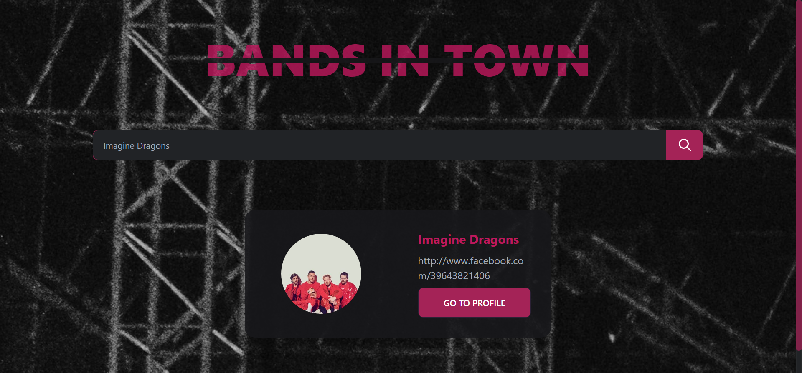
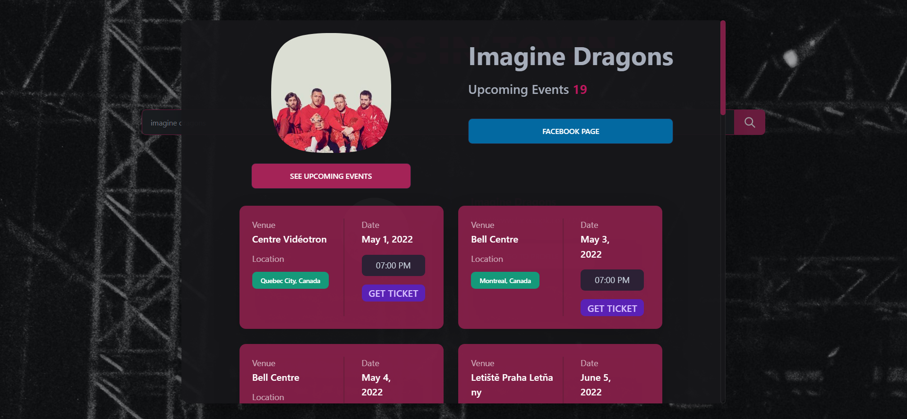
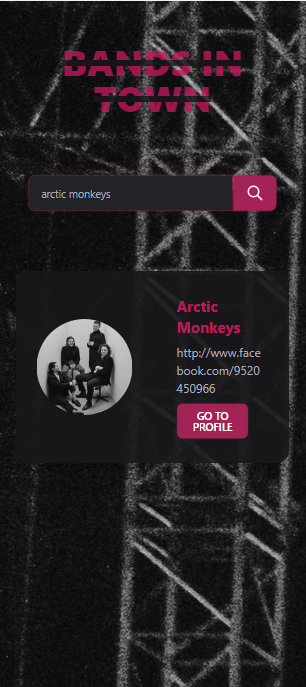
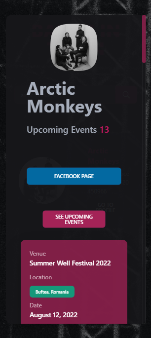

# Bands In Town Website

A single page web application that lets you search the bands by their names and then displays the band profiles along with their upcoming events.

## Deployed Website

The website is deployed on Netlify: [BandsInTown](https://bands0in0town.netlify.app/).

## Frameworks

    * ReactJS
    * Tailwind CSS - [Daisy UI]

## API

https://app.swaggerhub.com/apis/Bandsintown/PublicAPI/3.0.0

## UI

## Available Scripts

In the project directory, you can run:

### `npm install`

### `npm start`
